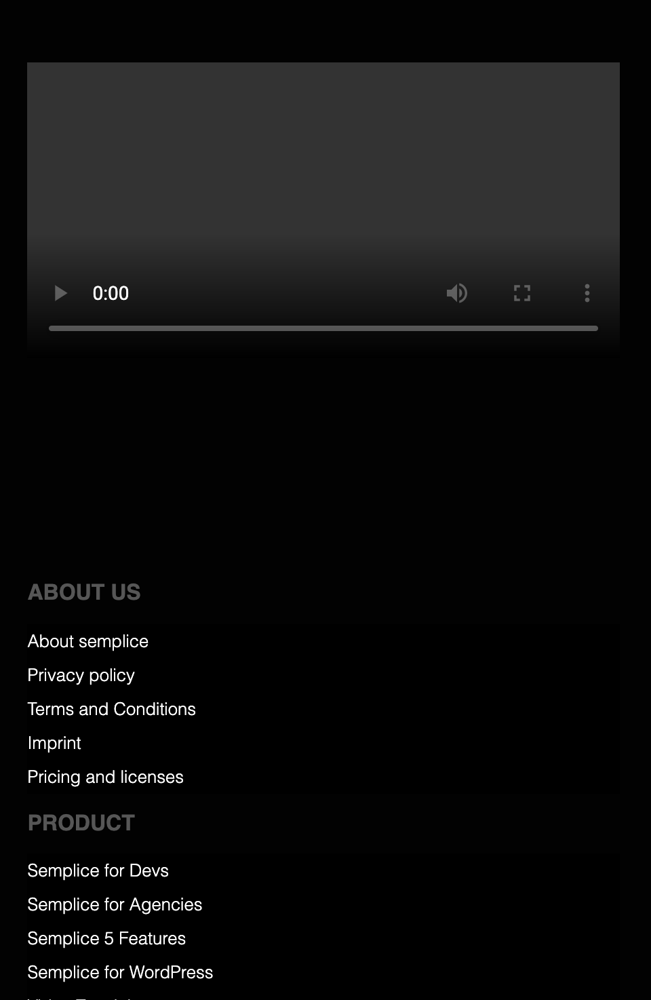

# Frontenddevelopmentsemplice
For my study Communication and Multimedia Design (subject: Frontend Development) I made 2 pages from a website with correct html, css and js. I decided to remake the website Semplice and the pages Homepage and Showcase. With my little experience with coding, for now, I made something I am very proud of.

This is the website I made:
https://cmdtamar.github.io/Frontenddevelopmentsemplice/

This is the website I remade: 
Www.semplice.com

The main focus with this project was responsiveness. To make the website work on different screens and adjust the details. 

## Source list

1. CSS Peeper Chrome Extension 
2. https://www.w3schools.com/html/html_layout.asp
3. https://www.w3schools.com/html/html_images.asp
4. https://www.w3schools.com/html/html_links.asp
5. https://www.w3schools.com/html/html_links_colors.asp
6. https://www.w3schools.com/cssref/pr_font_weight.asp
7. https://codepen.io/cmdtamar/pen/dyXxprm
8. https://www.youtube.com/watch?v=2KL-z9A56SQ
9. https://www.w3schools.com/html/tryit.asp?filename=tryhtml_lists_unordered_none
10. https://www.w3schools.com/cssref/sel_id.asp
11.https://www.w3schools.com/html/html5_video.asp
12.https://www.w3schools.com/css/css_grid_item.asp
13. https://www.w3schools.com/howto/howto_js_topnav_responsive.asp
14. Amsterdam University of Applied Science Communication and Multimediaa Design Frontend Development excercise Positionering 1
15. Roel Komen helped me with connection Javascript.
16. https://www.handleidinghtml.nl/css/css-elementen/css-elementen10.html
17. Roel Komen helped me with adding a dropdown menu
18. https://www.w3schools.com/cssref/css3_pr_transform.asp

## Work approach

The first thing I did was to make an overview of the content Semplice showed on the Homepage. I wrote this down and this gave me a simple hold-on when I started with html. Then I researched what the style of the website it, fonts they use, colours and images. 

### How it looked at the start of coding
For the first design I made the small-screen version of the homepage.

### The end result
https://cmdtamar.github.io/Frontenddevelopmentsemplice/

#### Kleinbeeld homepage

#### middelbeeld homepage

#### grootbeeld homepage

#### Kleinbeeld Showcase

#### Middelbeeld Showcase

#### Grootbeeld Showcase

